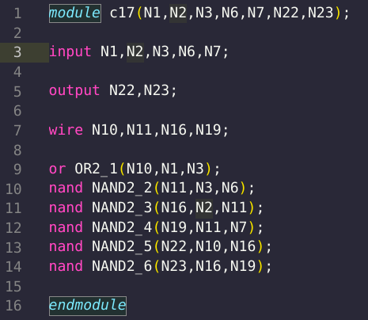

# Circuit to Graph

## Overview of the Project:
* This is a python script which reads and parses a verilog file as input
* Then it creates a directed acyclic graph(DAG) to represent the equivalent combinational circuit.
* We use python dictionaries to represent the DAG in the form of an Adjacency list.
* Then it enumerates all the possible paths from the circuit inputs to outputs recursively.
* The graph algorithm **Breadth First Search(BFS)** is used for this purpose.

___

## Constraints:
This programs accepts a 'valid' verilog file as an input. A verilog file is 'valid' if,
* It uses only the primitive gates, i.e. `or`, `and`, `not`, `nor`, `xor`, `xnor` and `nand`. These gates can have *`n`* inputs and 1 output.
* It doesn't use any external verilog module.(i.e. `` `include ``'s will not work)
* It should like like this:



*(Notice the absence of any tabs before any line of the file)*
___

## Execution method:
* Run this command

      $ python3 enumerator.py
* A prompt opens, enter the details. The verilog file should satisfy above constraints
    ```bash
    $ Enter a valid verilog file name: <filename>
    ```  
* It prints out the graph equivalent to the combinational circuit specified in the form of the input verilog file and also enumerates all the paths from inputs to outputs.

___         

